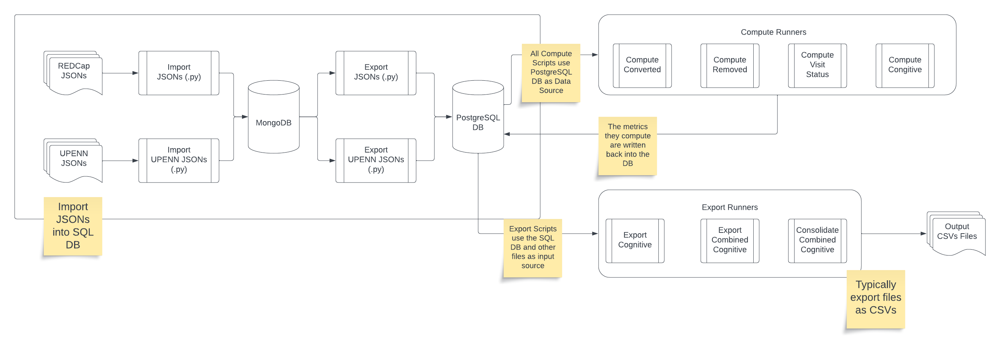

# FormsDB

This repository does ETL (Extract, Transform, Load) on the forms data from REDCap and UPENN JSONs. The data is then loaded into a MongoDB and PostgreSQL database. The data can then be used to compute derived metrics.

## Architecture



### Extract, Transform, Load

The data is extracted from REDCap and UPENN JSONs. Since JSONs are not relational, they are stored in a MongoDB database. This data is then transformed into a more user readable format JSON format, by doing the following:

- categorizing individual forms into their timepoints
  - i.e. Raw data is of the form `[{form_data_1}, {form_data_2}, {form_data_3}]` and is transformed into

        ```
        [
            {
                assist: {
                    screening: {form_data_1},
                    baseline: {form_data_2},
                    month_1: {form_data_3}
                },
                demographics: {
                    screening: {form_data_4}
                },
                ...
            }
        ]
        ```

- Adding metadata to each form
  - i.e. adding the number of variables with data, number of variables without data, total number of variables, and percent data available

        ```
        [
            {
                assist: {
                    screening: {
                        form_data_1,
                        metadata: {
                            variables_with_data: 10,
                            variables_without_data: 20,
                            total_variables: 30,
                            percent_data_available: 33.33
                        }
                    },
                    ...
                },
                ...
            }
        ]
        ```

#### Load

Data transformed into the above format is then loaded into a MongoDB database, to have a relatively raw form of the data. This data is then loaded into a PostgreSQL database, to have a more structured form of the data.

#### JSON to Relational

The data is transformed into a relational format, by doing the following:

- flattening the data i.e. `[{form_data_1}, {form_data_2}, {form_data_3}]` conatains 3 forms. Each form is extracted as a Form object, which is defined as:

    ```python
    class Forms:
        """
        Represents a REDCap / RPMS form.

        Attributes:
            subject_id (str): The ID of the subject.
            form_name (str): The name of the form.
            event_name (str): The name of the event / timepoint: e.g. "baseline_arm_1".
            form_data (dict): The data submitted in the form.
            source_m_date (datetime): The date the form data was retrieved from the source.
            metadata (dict): Additional metadata associated with the form.
        """

        def __init__(
            self,
            subject_id: str,
            form_name: str,
            event_name: str,
            form_data: dict,
            source_m_date: datetime,
            metadata: dict,
        ):
            self.subject_id = subject_id
            self.form_name = form_name
            self.event_name = event_name
            self.form_data = form_data
            self.source_m_date = source_m_date
            self.metadata = metadata

        def __str__(self):
            return f"{self.subject_id} {self.form_name} {self.event_name}"

        def __repr__(self):
            return f"{self.subject_id} {self.form_name} {self.event_name}"
    ```

  - This flattened data is then loaded into a PostgreSQL database. Thus, a single JSON file (for a subject) will potentially be broken down into multiple rows in the database.

#### FAQ

##### Why MongoDB?

Since data we are dealing with is not relational, it is easier to store it in a NoSQL database. MongoDB is a popular NoSQL database, and is easy to use. It also has a Python API, which makes it easy to interact with.

##### Why PostgreSQL?

We would like to be able to use SQL queries to query the data. PostgreSQL is a popular SQL database. Therefor, we load the data into a PostgreSQL database.

##### Why not just use PostgreSQL?

There are times where having a raw representation of the data is useful. For example, if we want to see the exact data that was extracted from REDCap, we can look at the MongoDB database. Having access to this relatively raw data is useful for debugging purposes, when some wrong assumption was made during the ETL process.
